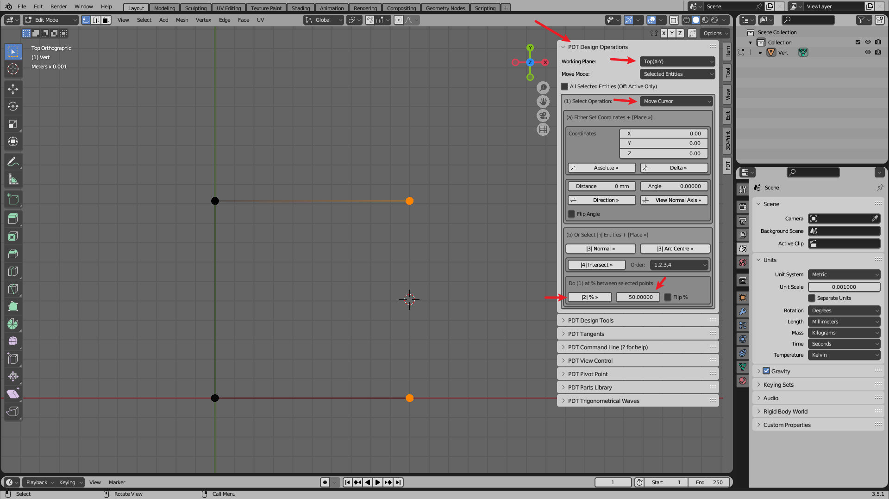
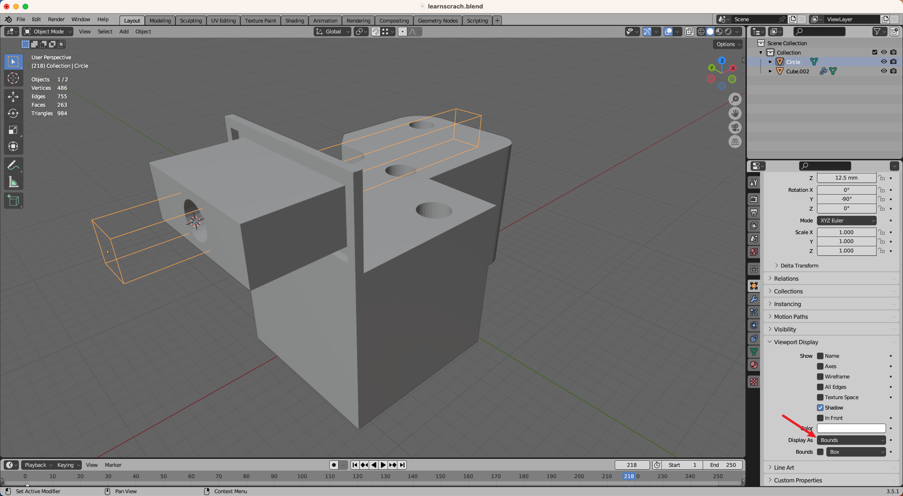

---
html:
  embed_local_images: true    # 将本地图片以 base64 格式嵌入
  embed_svg: true
  offline: true
  toc: false                   # 启用边栏目录并默认显示

print_background: true

export_on_save:
  html: true                  # 保存自动导出为 HTML
---

# Blender

by **Xingyu Zhou**

---

set units to millimeters:

`shift + a`: add object

`ctrl + middle mouse`: view zoom
`shift + middle mouse`: view pan
`middle mouse`: view rotate

`tab`: toggle edit mode (`EM`) and object mode (`OM`)

`EM | e > esc`: **extrude** (拉伸)

> 自定义的表示法：`EM | e > esc` 表示在 `EM` 下，按 `e` 键，然后按 `esc` 键。 `shift + a` 表示同时按下 `shift` 和 `a` 键。

`x`: delete
`a`: select all

to see objects clearly:

---

`n`: toggle right panel

`shift + select`: add to selection (多选)

place 3d cursor at the middle of selected vertices:

place 3d cursor at the intersection of two lines:

toggle x-ray in order to select back vertices.

show some useful overlays:

merge vertices:

**snap** (吸附) to vertices and messure (hold `ctrl` to snap):

**filet** (圆角) and **chamfer** (倒角):

> 除了倒角的 segment 设置为 1 外，其他尽量使用偶数。

place 3d cursor in relation to selected vertices:

`f`: **fill** face
`alt + shift + click`: select edge loop

fill the face with holes:

---

`shift + d > esc`: duplicate

`shift + g`: select grouped

join and part objects:

- 设置完每个对象的 material 后，就可以 part by material 了。

parent objects:

- 选择父对象不会选择子对象，但对父对象的操作会影响子对象。

为对象添加 material 颜色，方便区分：

---

use addon `measureit` to measure:

- 相对于自带的测量工具，好处有二。一是一旦选择好测量的对象，当该对象发生变化时，测量也会自动更新。二是可以自定义精确度。

use addon `align tools` to align objects:

- 对齐操作作用于对象的原点（**origin**）
- 将所有选中的对象对齐到激活的对象（active object）
- 在 OM 下，移动对象会连带原点一起移动，但在 EM 下，移动对象不会连带原点一起移动。实际上在 EM 下，原点是不会受到任何影响的

---

flip normal (翻转法线的方向)：

`alt + e > extrude along normals > s`: extrude along normals and keep right offset

move origin to 3d cursor:

- `shift + right click` to move 3d cursor
- `shift + right click > move + ctrl` to snap 3d cursor
- when move 3d cursor to a face, it will snap to that face automatically

`shift + s`: 3d cursor **pie menu**

`q`: open quick favorites menu

> add operation to quick favorites: `right click > add to quick favorites`

---

选取对侧到边按 `f` 即可填充面

inset (内插):

在该平面的中心打个孔：

> modifier has to make sure that normals are correct, so it's good to check normals before adding modifier

> modifier options 确定好后需要应用 (`cmd + a`) 才能生效

> 使用 display as bounds 的好处在于移动物体可以实时看到 modifier 的效果

> 或者使用 addon `booltool`，实现相同效果

do scale in edit mode, and don't do scale in object mode, cause it will mess up the scale of the object:

> this could be a reason why boolean modifier doesn't work
> if you do scale in object mode, you need to apply scale by `cmd + a`
> 
